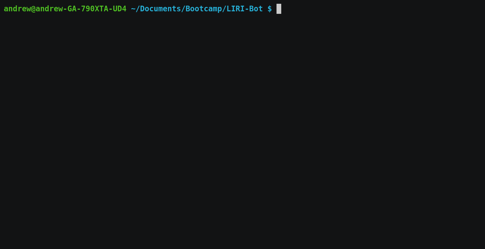

# LIRI-Bot

LIRI is a Language Interpretation and Recognition Interface. It's a command line app running through [Node.js](https://nodejs.org) that can find information about movies, songs, and concerts.

It was made as part of the University of Richmond Coding Bootcamp in January of 2019.



## Commands

* [concert-this](#concert-this)
* [do-what-it-says](#do-what-it-says)
* [movie-this](#movie-this)
* [spotify-this-song](#spotify-this-song)

### concert-this

`concert-this` takes an artist name and returns show information for their next concert.

Example
```bash
node liri.js concert-this "Mitski"
```

Output
```
Venue: Oxford Art Factory, Sydney
Location: Darlinghurst, Australia
Date: 02/04/2019
```

### do-what-it-says

`do-what-it-says` reads the file `random.txt` and performs the command specified in that file. It takes no parameters.

The contents of `random.txt` is expected to have either format `command,argument` or `command` (no argument) where *command* is another LIRI command and *argument* is the argument for that command.

Example
```bash
node liri.js do-what-it-says
```

Assume `random.txt` has these file contents.
```
spotify-this-song,"I Want it That Way"
```

Output
```
Spotify keys have been loaded.
Track Name: I Want It That Way
Artists: Backstreet Boys
Album: The Hits--Chapter One
Preview URL: https://p.scdn.co/mp3-preview/e72a05dc3f69c891e3390c3ceaa77fad02f6b5f6?cid=d25919c9bca5488abc7c817d7fde2816
```

### movie-this

`movie-this` takes a movie name and returns information about that movie.

Example
```bash
node liri.js movie-this "Star Wars"
```

Output
```
Title: Star Wars: Episode IV - A New Hope
Released: 25 May 1977
IMDB Rating: 8.6
Rotten Tomatoes Rating: 93%
Country: USA
Language: English
Plot: Luke Skywalker joins forces with a Jedi Knight, a cocky pilot, a Wookiee and two droids to save the galaxy from the Empire's world-destroying battle station, while also attempting to rescue Princess Leia from the mysterious Darth Vader.
Actors: Mark Hamill, Harrison Ford, Carrie Fisher, Peter Cushing
```

### spotify-this-song

`spotify-this-song` takes a song name and finds that song on [Spotify](https://www.spotify.com). This command requires app authorization credentials, see [Spotify Credentials](#spotify-credentials).

Example
```bash
node liri.js spotify-this-song "I Want it That Way"
```

Output
```
Spotify keys have been loaded.
Track Name: I Want It That Way
Artists: Backstreet Boys
Album: The Hits--Chapter One
Preview URL: https://p.scdn.co/mp3-preview/e72a05dc3f69c891e3390c3ceaa77fad02f6b5f6?cid=d25919c9bca5488abc7c817d7fde2816
```

#### Spotify Credentials

In order to use the [`spotify-this`](#spotify-this) command, it's required to obtain your own app authorization credentials on the [Spotify developer site](https://developer.spotify.com/dashboard/). Log in to a spotify account and create a new client ID. After registering the app, the *client ID* and *client secret* can be found in the application info.

To specify these to LIRI, a file named `.env` containing the credentials has to be added to the working directory. The contents of this file should be as follows.

```
SPOTIFY_ID=your-client-id
SPOTIFY_SECRET=your-client-secret
```
